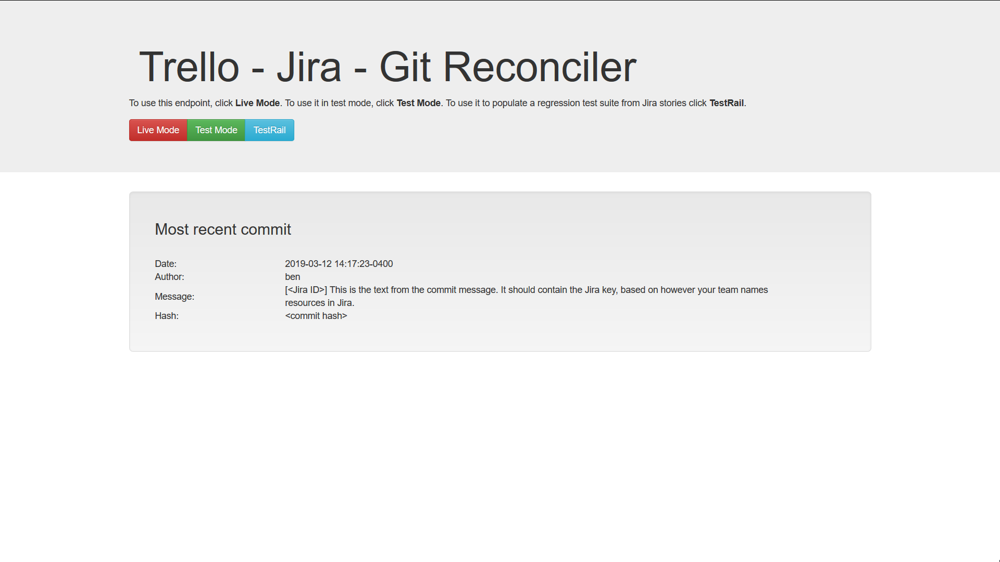

**GitTreasures**

A solution for facilitating [Gitflow](https://www.atlassian.com/git/tutorials/comparing-workflows/gitflow-workflow) using a source control application, a source of support tickets and/or new development stories, and a Kanban type board. For source control, currently git based option GitLab is supported, along with plans to add GitHub support in the very near future. There is also support for a local git instance. The development tasks can come from Jira, from GitHub or GitLab issues. Support for other issue tracking software is not on the foreseeable horizon, but it is definitely something I would be interested in working with someone else on if anyone wanted to help. Lastly, Trello is the project board I chose due to its flexibility and ease of use. 

**Why not just use the existing integrations between those tools, you ask?**

Great question! If your tooling is solely for personal projects and you would rather use the existing integrations, becasue you control all of the aspects, then by all means use those instead. 

If you work for someone who lets you have direct access to the repositories and the support ticketing system, or you are the one who makes those decisions, then you may also choose to use an existing solution.

If any one of those systems is provided to you, but are restricted in such a way that it is not possible to access the data you need, then hacky workarounds are your friend. This was created during a time when I didn't have the ability to just hook into Jira and tightly couple Trello actions to it. 

Even with all the existing tools at your disposal, you may decide you want to do something fancy, or something hyper specific to your own workflow that the other plugins do not support. GitTreasures can be easily extended and is written in Python to make development fast and fun.

**Instructions**

*If using Python 3*

Due to changes in the urllib package between Python 2 and 3, Python 3 users must modify the first line in `__init__.py` of the Trello package in `/<python directory>/Lib/site-packages/trello/`. Instead of `from urllib import quote_plus`, that import statement should be `from urllib import parse`

These instructions are for integration with a GitLab hosted repository. GitHub integration is not set up yet but will likely be very similar to GitLab. Task scripts will be kept around for setup with a local copy of just the commits (I think I ran `git clone --no-checkout` to just get the Git data) but further documentation will not be prioritized for a while (feel free to help with that).

**Steps**

1) Clone repo wherever you want to use GitTreasures

`git clone <repository>`

2) Create `data/` inside `GitTreasures/`

`cd GitTreasures/ && mkdir data`

3) Copy `task_scripts/init.py` script to project root

`cp task_scripts/init.py .`

4) Run `init.py` to initialize the database with commit data

`cd ../ && python init.py`

**Endpoint**

This tool has the option of being run from the command line, a CI server such as Travis or Jenkins, or as an endpoint with a simple Flask front end:

To run this endpoint locally:

`python endpoint.py`

Then in your browser, navigate to `http://localhost:5000/` and click one of the links to run GitTreasures in Live Mode or Test Mode, or the TestRail update script.
